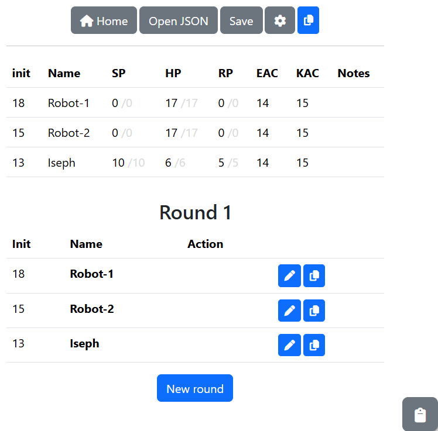

# Encounter

You use an encounter to track actions in a combat. You can copy formated text from the application, and then paste it into your chosen PbP platform.

## Basic functionality

### Choosing an output format

The currently supported formats for outputted text are as follows:

* Paizo forums
* Discord (Sage)

To choose an output format, complete the following steps:

1. At the top of the encounter page, select the cog icon.
2. From the **Platform** list, select an output format.
3. Select **Close**.

### Creating a new round

**Important**: Only creatures that have an initiative greater than zero in the stat table will be added to the round.

* To create a new round, select **New round**.

### Changing a value in the stat table

If you need to adjust an individual value, for example, to set an initiative or manually apply damage, complete the following steps:

1. In the stat table, select the value that you want to change.
2. Press the plus key (+) on your keyboard to increase the value by one, or the minus key (-) to decrease the value by 1.

### Copying status text for a round

**Note**: The application outputs text formatted for block initiative. For example, if the next two creatures to act belong to players, both will be highlighted as able to act. If the order of the initiative is a player, and then an enemy, only the player is highlighted to act.

To copy status text for a round, complete the following steps:

1. At the top of the encounter page, select the copy icon.
2. In the lower right corner, select the scratch pad icon.
3. Copy the text from the scratch pad.

**Note**: For enemy creatures, hit points are shown as the amount lost and start at zero.

### Entering an action for a round

* To enter an action for a creature, select the pencil icon in their row. If the action is an attack, see the following sections.

### Copying formatted text for a prepared enemy attack

Use the following steps when you have defined an attack in the encounter template. This presumes that you will paste the attack details into your chosen PbP platform, which will then roll dice to determin the result.

1. Select the pencil icon in the creature's row.
2. In the **Enter an action** panel, turn on **Attack**.
3. From the list, select an attack.
4. From the tags underneath the **Target** field, select the target of the attack.

5. Select **Save**.
6. Select the copy icon in the creature's row.
7. In the lower right corner, select the scratch pad icon.
8. Copy the text from the scratch pad.

### Entering the results of a dice roll

After the virtual dice have been rolled in the encounter template, you can enter those results back into the application.

**Important**: The hit result will be compared against the target's EAC or KAC, depending on the damage type, and damage automatically applied on a success. Damage will be applied to stamina first, and then hit points. If the damage is direct to HP, or EAC/KAC is adjusted due to an effect, take damage may be applied incorrectly.

1. Select the pencil icon in the creature's row.
2. In the **Hit** field, enter the result of the roll to hit.
3. In the **Damage** field, enter the result of the damage roll.
4. Select **Save**.

### Entering an unprepared attack

In most cases, a player will enter the attack details in the PbP platform, and the rolls will be made immediately. In these cases, you can enter the attack directly into the application.

1. Select the pencil icon in the creature's row.
2. In the **Enter an action** panel, turn on **Attack**.
3. From the tags underneath the **Target** field, select the target of the attack.
4. In the **Hit** field, enter the result of the roll to hit.
5. In the **Damage** field, enter the result of the damage roll.
6. In the **Type** field, enter the appropriate abbreviate for the damage type.
7. Select **Save**.

## Advanced functionality

### Editing the JSON

All of the information relating to the encounter is encoded in JSON. You can modify this directly to change any aspect of the encounter.

**Warning**: There is no backup of an encounter. You could accidentally break the entire encounter. A check is performed when you save the JSON to check that it is valid. However, being valid does not mean that it is in the correct format for the application or contains all of the required data.

* To edit the JSON, Select **Open JSON** at the top of the encounter page.

### Defining an attack in the encounter

To define an attack, complete the following steps:

1. Select the pencil icon in the creature's row.
2. In the **Enter an action** panel, turn on **Attack**.
3. From the list, select **New**.
4. In the field to the right of the list, enter a name for the attack.
5. From the tags underneath the **Target** field, select the target of the attack.
6. In the **Hit** field, enter the to hit roll. Include 1d20. For example, *1d20+4*.
7. In the **Damage** field, enter the damage roll. For example, *2d6+3*.
8. In the **Type** field, enter the appropriate abbreviate for the damage type.
9. Select **Save**.

### Adding notes for creatures

You may want to add notes for a creature. For example, to indicate a status effect. To open the Notes panel, complete the following step:

* In the stats table, select the cell in the notes column.

Notes are included in the formatted status text.